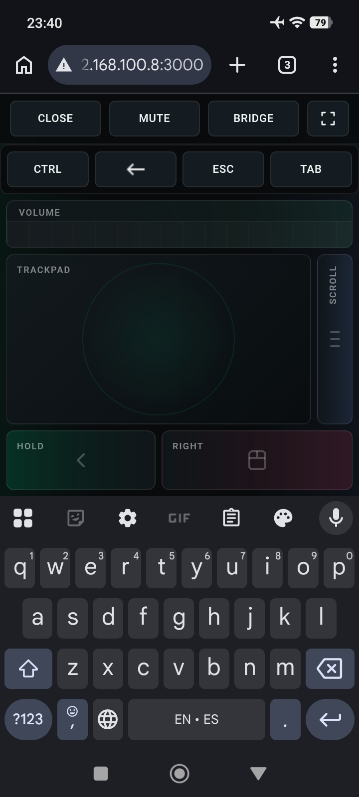
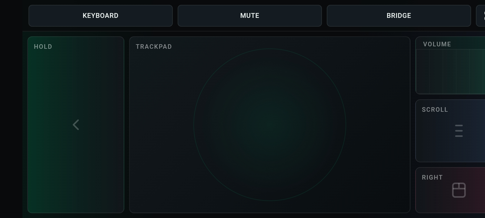

# Linka


Linka turns a phone browser into a trackpad, keyboard, scroll pad, and volume controller for a Windows PC or Mac.

It exists for couch, TV, projector, and desk setups where reaching for a physical mouse, keyboard, or quick transfer tool is inconvenient. The desktop app starts a local server, shows a QR code, and keeps the controller available from the desktop tray or menu bar.

macOS note:
Linka on macOS needs the right system permissions to work correctly.
Grant `Accessibility` to the app that actually launches Linka, which may be `Linka.app`, `Terminal`, or your editor if you run it from there.
If you use Bridge screen capture, also grant `Screen Recording` to that same app.
If macOS asks for `Local Network` access, allow it so your phone can reach Linka over the LAN.
After changing permissions, fully quit Linka and open it again.
Run `npm install` fresh on macOS and do not copy `node_modules` from a Windows checkout, or Electron may resolve to `electron.exe` instead of the macOS app binary.

Linka has two local modes:

- Remote mode: phone-based trackpad, keyboard, scroll, mouse, volume, and mute controls.
- Bridge mode: a temporary local space for sending text, images, and small files between phone and PC over the same WebSocket connection.

## Screenshots

<p>
  
  
</p>

## Features

- Phone-based trackpad with hold and right-click controls.
- Pinch-to-zoom and multi-touch gesture support.
- Scroll, keyboard, volume, and mute controls.
- **Volume sync**: phone slider reflects the actual PC volume on connect.
- Bridge mode for local text, image, and file transfer between phone and PC.
- Ephemeral in-memory Bridge messages with no database, cloud sync, or permanent storage.
- Bridge uploads limited to 5 MB per file, measured before base64 encoding.
- Portrait and landscape mobile layouts with fullscreen support.
- Local HTTP/WebSocket connection over your network — no cloud dependency.
- **QR code generated locally** — no external API calls, your LAN IP never leaves the PC.
- **Screen wake lock** — phone screen stays on while connected.
- **Auto-recovery**: the native input helper respawns automatically if it crashes.
- **Reconnect persistence**: once paired, the mobile client can automatically rejoin the current desktop session after a refresh or browser reopen.
- Native input backends for Windows and macOS.
- Portable Windows Electron build with a bundled native input helper.

## Platform Status

- Windows: full desktop support, native input helper, Windows packaging scripts, installer and portable build flow.
- macOS: desktop support is available and tested for local use. Mouse, click, right click, scroll, keyboard, volume, and mute work through the native macOS helper.
- macOS packaging is currently intended for local builds and internal testing. Windows packaging remains the more complete release path today.

### Security

- Content-Security-Policy, X-Content-Type-Options, X-Frame-Options, and X-DNS-Prefetch-Control headers.
- WebSocket rate limiting (200 msg/s per client).
- WebSocket message size limit (8 MB) and Bridge file size limit (5 MB decoded).
- WebSocket heartbeat (30 s) detects and terminates stale connections.
- Pairing and reconnect tokens are scoped to the current desktop app session and are validated before control commands are accepted.
- Clipboard fallback for non-HTTPS contexts.
- Electron context isolation enabled; node integration disabled in renderer.
- Linka is still designed for trusted local networks only. Do not expose it to public or untrusted networks.

### macOS Distribution Notes

- Linka for macOS currently requests `Accessibility` so it can control mouse and keyboard input. This is a high-impact permission and should only be enabled on machines you trust.
- `Screen Recording` is only needed when using Bridge screen capture, and should not be enabled unless that feature is actually needed.
- macOS may also prompt for `Local Network` access so phones on the same LAN can connect to Linka.
- For local development, run Linka directly from the repo or from a locally generated app bundle on your own Mac.
- Before distributing a macOS app build to other users, sign and notarize it properly. Unsigned or quarantined builds can trigger Gatekeeper warnings such as `cannot be verified` or `Move to Trash`.
- Keep the app's permissions narrow and honest. Avoid bundling unrelated capabilities or background behavior that would make App Review or Gatekeeper trust harder.

## Requirements

- Windows or macOS for native mouse and keyboard control.
- Node.js 20 or newer.
- .NET 8 SDK for building the Windows native input helper.
- Xcode Command Line Tools for building the macOS native input helper.
- Phone and PC on the same local network.

### macOS Setup

```bash
rm -rf node_modules
npm install
npm run build:native:mac
npm run dev
```

Before testing input control on macOS, confirm these permissions:

- `System Settings > Privacy & Security > Accessibility`: required for mouse, keyboard, scroll, volume, and mute control.
- `System Settings > Privacy & Security > Screen Recording`: required only if you use Bridge screen capture.
- `System Settings > Privacy & Security > Local Network`: allow it if macOS prompts, so your phone can connect to the local Linka server.

Important:

- Grant the permission to the app that launches Linka. If you run from Terminal, grant Terminal. If you run the packaged app, grant `Linka.app`.
- After enabling a permission, quit and reopen the launching app, then reopen Linka.
- If macOS still shows stale launcher behavior, reopen the Electron-generated `Linka.app` so the OS re-registers the correct bundle.

If you want a local clickable macOS app bundle for testing:

```bash
npm run build:mac:app
```

If Electron still looks cross-platform wrong after copying a workspace between machines, run:

```bash
npm run electron:rebuild
```

## Quick Start

```bash
npm install
npm run dev
```

Scan the QR code shown by the desktop window with your phone camera. No external service is involved — the QR is generated entirely on your PC.

Windows-native input build:

```powershell
npm run build:native:win
```

macOS-native input build:

```bash
npm run build:native:mac
```

## Usage

- Use the phone screen as a trackpad. Tap for left-click, two-finger tap for right-click.
- Use the scroll strip for vertical scrolling.
- Use Hold for click-and-drag.
- Use Right for right-click.
- Use Keyboard to open mobile typing controls with Backspace, Esc, and Tab shortcuts. On macOS, the shortcut modifier is shown as `⌘`; on Windows, it remains `Ctrl`.
- Use Mute and Volume for desktop audio control. The volume slider syncs to the desktop's actual level on connect.
- Use Bridge to switch into a clean transfer panel for sending text snippets and images between phone and PC.
- Tap Capture in Bridge to screenshot the PC screen.
- Use Copy on text items and Download on image items. Bridge data is RAM-only and disappears when the app/server restarts.
- Use `Forget` on mobile to clear the saved session from that browser.
- Use `Reset Pairing` in the desktop tray/menu bar to invalidate all current mobile reconnect tokens and force a fresh scan.

The local status endpoint is available at:

```text
http://localhost:3000/api/status
```

To use a different port:

```bash
LINKA_PORT=3001 npm run dev
```

On Windows PowerShell:

```powershell
$env:LINKA_PORT=3001
npm run dev
```

## Build

Create the Windows installer:

```powershell
npm run build:win
```

Output:

```text
dist_electron\Linka-Setup.exe
```

The installed app starts with Windows in the background, launches the local server, and stays available from the system tray. To create a portable executable instead, run `npm run build:win:portable`.

Create a local macOS app bundle for testing:

```bash
npm run build:mac:app
```

This macOS build path is currently best treated as a local/internal bundle. For broader distribution, sign and notarize the `.app` before sharing it.

## Project Structure

```text
.
|-- index.html                  # Mobile remote and Bridge UI
|-- main.js                     # Electron main process and tray app
|-- server.js                   # Local HTTP/WebSocket server
|-- input-adapter.js            # Native input adapter selection and recovery
|-- connection-preload.cjs      # Electron preload (context isolation)
|-- native/mac-input/           # Swift macOS input helper (Quartz + CoreAudio)
|-- native/win-input/           # .NET Windows input helper (SendInput + Core Audio)
|-- scripts/                    # Build helper scripts
|   |-- patch-electron-icon.cjs  # Replaces Electron's base icon before Windows packaging
|   |-- apply-windows-icon.cjs   # Applies Linka icon to win-unpacked/Linka.exe
|   `-- generate-mac-icon.cjs    # Generates Linka.icns for local macOS builds
|-- docs/images/                # README screenshots
|-- build/linka-icon.ico        # Windows app icon
|-- build/linka.icns            # macOS app icon
|-- build/linka-logo.png        # Project logo asset
|-- build/installer.nsh         # NSIS installer macros (auto-start registry)
`-- linkalogo.png               # Legacy project logo asset
```

## Contributing

Issues and pull requests are welcome. Keep changes focused, describe what you tested, and avoid committing generated build output. See [CONTRIBUTING.md](CONTRIBUTING.md).

## Support

If you find Linka useful, you can support its continued development with a voluntary contribution:

[PayPal](https://paypal.me/antoniomartinez75)

Contributions help maintain, improve, and keep the project evolving.

## License

Linka is released under the MIT License. See [LICENSE](LICENSE).
